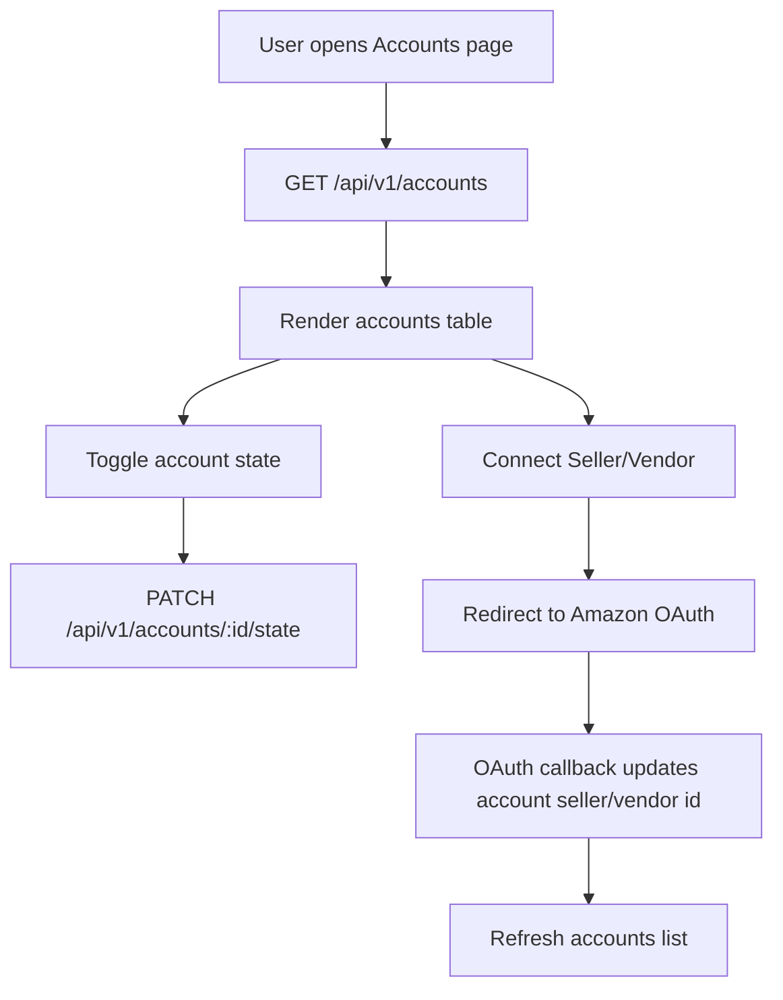

# Accounts Page (Frontend + Backend)

Purpose: Build the Accounts page in the Next.js frontend with legacy parity, and add backend support for account state updates and richer account payloads.

## Goals
- Match legacy Accounts page behavior: list accounts, toggle active/disabled, and connect seller/vendor accounts.
- Reuse existing Clerk org context and account selection flow.
- Support Amazon Seller/Vendor connection via existing OAuth utilities and backend callback.
- Expose account `created_at` in the API so the frontend can display created date.
- Add a backend endpoint to update account state with validation and auth.

## Non-Goals
- Full redesign of the accounts UI or table structure.
- New integrations beyond Amazon Seller/Vendor.
- Changes to the Amazon Ads OAuth flow.

## Architecture

### Frontend
- **Legacy reference**: `legacy/src/pages/accounts.tsx` for UI structure, empty/loading/error states, and connect/toggle flows.
- **Route**: `apps/frontend/src/app/(app)/accounts/page.tsx`.
- **Context**: `apps/frontend/src/contexts/account-context.tsx` for account list + selection.
- **API client**: new `apps/frontend/src/api/accounts.ts` for PATCH state updates.
- **Integrations UI**: reuse `apps/frontend/src/components/integrations/seller-vendor-modal.tsx`.
- **OAuth helpers**: `apps/frontend/src/utils/amazon-sp.ts` for Seller/Vendor URLs.

### Backend
- **Routes**: `apps/backend/src/modules/accounts/routes.ts`.
- **Controllers**: `apps/backend/src/modules/accounts/controllers/accounts-controller.ts`.
- **Services**: `apps/backend/src/modules/accounts/services/account-service.ts`.
- **Repositories**: `apps/backend/src/modules/accounts/repositories/account-repository.ts`.

### Data Flow
1. User opens `/accounts`.
2. Frontend loads accounts via `GET /api/v1/accounts` (org scoped).
3. User toggles account state -> `PATCH /api/v1/accounts/:accountId/state`.
4. User clicks Connect Seller/Vendor -> Seller/Vendor modal -> OAuth URL built with `buildAmazonSpOAuthUrl`.
5. Amazon callback hits `/api/v1/integrations/amazon-sp/oauth/callback` and updates account seller/vendor IDs.
6. Frontend refreshes account list to show connection status.

## Endpoint/Interface Summary

| Method | Path | Description | Request Notes |
| --- | --- | --- | --- |
| `GET` | `/api/v1/accounts` | List accounts for org | Response includes `seller_id`, `vc_id`, `state`, `created_at` |
| `PATCH` | `/api/v1/accounts/:accountId/state` | Update account state | JSON body `{ state: "active" | "disabled" }` |
| `GET` | `/api/v1/integrations/amazon-sp/oauth/callback` | Amazon Seller/Vendor OAuth callback | Uses `state=orgId,region,accountId,accountType` |

## Mermaid Flow

## UX/Behavior Requirements

### Header + Actions
- Title: "Accounts" with subtitle text.
- Primary action button: "Add Account" (route to the connect ads flow).

### Loading + Error States
- Full-page loading state while accounts load.
- Error state with retry action when account fetch fails.

### Table
- Columns: State toggle, Name, Account Type, Country, Created Date, Seller Account, Vendor Account.
- State toggle updates inline and shows "Updating..." when pending.
- Seller/Vendor columns show "Connected" when IDs exist, otherwise a Connect button.

### Connect Seller/Vendor Modal
- Reuse `SellerVendorModal` with the `amazonRegions` list.
- Build OAuth URL using `buildAmazonSpOAuthUrl` and redirect.
- Block connect action if `orgId` is missing (show inline error or toast).

## Error Handling
- `GET /api/v1/accounts` failures show an inline error + Retry button.
- `PATCH /state` validation errors return 400; missing auth returns 401; missing org returns 400.
- State update failures show a toast or inline error and leave UI state unchanged.
- OAuth URL generation errors show a toast and keep modal open.

## Implementation Phases

### Phase 1: Backend API updates
Goal: expose created_at and allow state updates.

Files to create/modify:
- `apps/backend/src/modules/accounts/routes.ts`
- `apps/backend/src/modules/accounts/controllers/accounts-controller.ts`
- `apps/backend/src/modules/accounts/services/account-service.ts`
- `apps/backend/src/modules/accounts/repositories/account-repository.ts`

Tasks:
 - [x] 1. Add `created_at` to account select payloads.
- [x] 2. Add repository/service method to update account `state` by `accountId` scoped to `orgId`.
- [x] 3. Add `PATCH /api/v1/accounts/:accountId/state` controller using `readJsonBody`, `requireString`, and `resolveAuthContext`.
- [x] 4. Return 404 when account not found for org.

Verification:
- Manual request to `PATCH /api/v1/accounts/:id/state` with valid/invalid payloads.

### Phase 2: Frontend data + types
Goal: wire account state updates and new fields.

Files to create/modify:
- `apps/frontend/src/contexts/account-context.tsx`
- `apps/frontend/src/api/accounts.ts`
- `apps/frontend/src/types/accounts.ts` (new or inline type update)

Tasks:
- [x] 1. Extend Account type to include `seller_id`, `vc_id`, and `created_at`.
- [x] 2. Add API helper for state updates.
- [x] 3. Ensure account context handles the updated payload shape.

Verification:
- Typecheck frontend workspace.

### Phase 3: Accounts page UI
Goal: replace the stub Accounts page with the full table + modal flow.

Files to create/modify:
- `apps/frontend/src/app/(app)/accounts/page.tsx`
- `apps/frontend/src/components/integrations/seller-vendor-modal.tsx` (reuse only)
- `apps/frontend/src/utils/amazon-sp.ts` (reuse only)

Tasks:
- [x] 1. Build the table UI mirroring legacy columns and empty state.
- [x] 2. Wire state toggle to the new PATCH endpoint with optimistic UI + refresh.
- [x] 3. Implement Seller/Vendor connect flow using `SellerVendorModal` and `buildAmazonSpOAuthUrl`.
- [x] 4. Implement Add Account CTA routing to the connect ads flow.

Verification:
- Manual QA: loading, empty state, toggle state, connect modal, and refresh.

## Code Changes Summary
- Add an account state update endpoint in the backend and include `created_at` in account responses.
- Extend frontend account types and add a simple API client for state updates.
- Replace the Accounts page stub with a legacy-parity UI and Seller/Vendor connect modal.

## All Code Changes Required

### Frontend
- `apps/frontend/src/app/(app)/accounts/page.tsx`: build the page layout, table, and modal handling.
- `apps/frontend/src/api/accounts.ts`: PATCH account state update helper.
- `apps/frontend/src/contexts/account-context.tsx`: include `seller_id`, `vc_id`, `created_at` in the account type and normalization.
- `apps/frontend/src/types/accounts.ts`: shared account type (if extracted).

### Backend
- `apps/backend/src/modules/accounts/routes.ts`: register the PATCH state route.
- `apps/backend/src/modules/accounts/controllers/accounts-controller.ts`: add `handleUpdateAccountState`.
- `apps/backend/src/modules/accounts/services/account-service.ts`: add update state service.
- `apps/backend/src/modules/accounts/repositories/account-repository.ts`: update select queries and add update state query.

## Code Drafts (Reference Implementation)

Notes instead of raw code:
- `apps/frontend/src/app/(app)/accounts/page.tsx`:
  - Use `useAccountContext` for accounts + loading/error.
  - Keep local state for `updatingStates` and modal selections.
  - On toggle, call `updateAccountState(accountId, nextState)` then `refreshAccounts`.
  - On Connect, open `SellerVendorModal` with `amazonRegions` and `accountType`.
  - `buildAmazonSpOAuthUrl({ region, orgId, accountId, accountType })` and redirect.
- `apps/backend/src/modules/accounts/controllers/accounts-controller.ts`:
  - Parse `accountId` from the URL path.
  - Read JSON body and validate `state` in `{ "active", "disabled" }`.
  - Ensure user/org auth; return 404 if no account.
  - Return the updated account payload.
- `apps/backend/src/modules/accounts/repositories/account-repository.ts`:
  - Add `created_at` to all account selects.
  - Add `updateAccountStateById(accountId, orgId, state)` query.

## Implementation Order
1. Backend: add created_at and state update endpoint.
2. Frontend: extend account type + add state update API.
3. Frontend: build accounts table UI + modal flow.

## Testing Requirements
- Backend: manual request tests for PATCH state with success and validation errors.
- Frontend: manual UI QA of loading/empty states, state toggle, and connect modal redirect.
- Optional: add unit tests for account API helper.

## Decisions
- Use `PATCH /api/v1/accounts/:accountId/state` to keep state updates explicit.
- Reuse Seller/Vendor modal and OAuth helper to avoid new modal work.

## Open Questions
- Confirm the desired route for "Add Account" (suggest `/auth/connect-ads`).
- Should the table show `seller_id`/`vc_id` values or just a "Connected" label?
- Do we need to expose `ams_subscribed_at` in the table?
