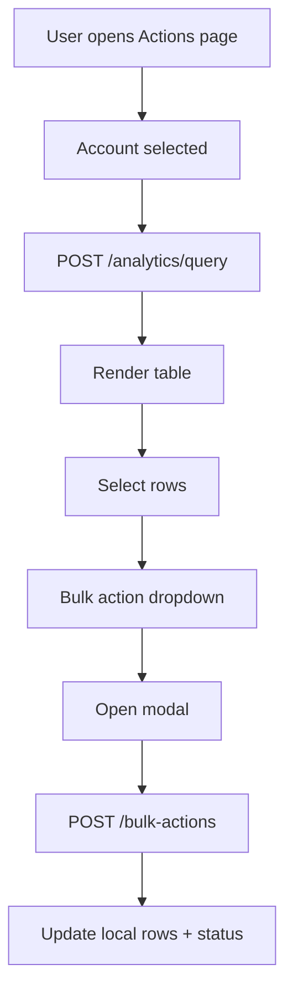

# Actions Page (Bulk Actions)

Purpose: Build the Actions page in the Next.js frontend to match the legacy Bulk Actions UI and behavior, while fetching rows via the unified analytics query endpoint.

## Goals
- Match the legacy design system and layout for the Bulk Actions experience.
- Preserve user flows: filtering, selection, bulk actions, export, and modals.
- Use the analytics query endpoint for row data.
- Keep all queries scoped to the selected account and date range.
- Show an overall summary footer for the full result set (not just the current page).

## Non-Goals
- Visual redesigns or layout changes.
- Changing backend APIs beyond analytics query field coverage.

## Architecture

### Frontend
- **Route**: `apps/frontend/src/app/(app)/actions/page.tsx`.
- **Feature components** under `apps/frontend/src/components/bulk-actions` for header, filters, dropdown, and table.
- **Hooks** under `apps/frontend/src/hooks/bulk-actions` for data fetching, filters, selection, and table config.
- **Utilities** under `apps/frontend/src/utils/bulk-actions` for mappings, formatting, filter operators, export, and action handlers.
- **Modals** under `apps/frontend/src/components/modals` with provider/manager and action-specific forms.

### Backend (Existing APIs)
- **Row fetch**: `POST /api/v1/analytics/query`.
- **Portfolios**: `GET /api/v1/entities/portfolios`.
- **Bulk actions**: `POST /api/v1/bulk-actions`.

### Data Flow
1. Load `/actions` with selected account.
2. Fetch rows via `POST /api/v1/analytics/query` using date range, filters, and sort.
3. Fetch summary via `POST /api/v1/analytics/query` in `summary` mode using the same date range and filters.
4. Render filters, table, and summary footer.
5. User selects rows and triggers bulk action modal.
6. Confirm action -> `POST /api/v1/bulk-actions`.
7. Apply optimistic local updates and show success/error status.

## Endpoint/Interface Summary

| Method | Path | Description | Request Notes |
| --- | --- | --- | --- |
| `POST` | `/api/v1/analytics/query` | Fetch rows | Payload includes `entity`, `timeRange`, `dimensions`, `metrics`, `filters`, `filterLogic`, `sort`, `pagination` |
| `GET` | `/api/v1/entities/portfolios` | Portfolio dropdown options | Query param `account_id` |
| `POST` | `/api/v1/bulk-actions` | Execute bulk updates | Payload includes `entity_type`, `action_type`, `entities`, `account_id` |

## Mermaid Flow

## UX/Behavior Requirements

### Header + Tabs
- Title: "Bulk Actions".
- Tabs: Campaign, Targets, Search Term, ASIN.
- Tab change resets selection, clears rows, increments data version, triggers fetch.
- Date range selector on the right; default to last 30 days.

### Filters (Segmentation)
- AND/OR selector plus condition builder (field, operator, value).
- Numeric operators: between, lt, gt, eq, gte, lte.
- String operators: eq, ne.
- Portfolio field uses a dropdown populated by `GET /entities/portfolios` with a 1-hour per-account cache.
- Apply triggers server fetch; Clear resets inputs and triggers fetch with empty conditions.
- Show "Show {Entity} having ..." summary sentence.

### Table
- Sticky selection column and sticky first data column.
- Columns ordered by `ENTITY_FIELD_MAPPING`, with `state` first if present.
- Sorting by clicking header; toggles asc/desc and triggers analytics query.
- State column provides a toggle for enable/pause.
- Client-side pagination with page sizes [10, 25, 50, 100].
- Add a summary footer row at the bottom of the table showing totals for the full result set (use a summary query, not just the current page).
- Table body should be fixed height and scrollable; keep the rest of the page static.

### Bulk Actions
- Only render dropdown if `selectedCount > 0`.
- Actions by entity (same as legacy):
  - Campaign: pause, enable, enable B2B, increase/decrease/set budget, bidding strategy.
  - Target: pause, enable, update bid.
  - Search term: add as negative, add as target.
  - Ad: none.
- Actions open modals and confirm on submit.

### Export
- Export CSV of displayed rows.
- File name format: `bulk_actions_{entity}_{from}_to_{to}.csv` or `bulk_actions_{entity}_all_time.csv`.
- Place the Export CSV button aligned to the right in the table header/actions row.

### Loading and Messages
- Full-page loader while accounts or first fetch is in progress.
- Inline "Refreshing ..." banner when refetching with existing rows.
- Success message in green; error message in red.

## Error Handling
- Validation errors in modals block submission with disabled buttons.
- API failures show inline error text; do not crash the page.
- Bulk action failures do not clear selection and show error message.
- Portfolio fetch errors log to console in dev and continue without breaking filters.

## Implementation Phases

### Phase 1: Types + Constants + Utilities
Goal: Build foundational types and helpers for mappings, formatting, filters, and export.

Files to create/modify:
- `apps/frontend/src/types/actions.ts`
- `apps/frontend/src/utils/bulk-actions/constants.ts`
- `apps/frontend/src/utils/bulk-actions/data-transform.ts`
- `apps/frontend/src/utils/bulk-actions/filter-utils.ts`
- `apps/frontend/src/utils/bulk-actions/export.ts`

Tasks:
- [x] 1. Define entity types, metric keys, and field mappings.
- [x] 2. Implement value formatting and row normalization helpers.
- [x] 3. Implement filter operator helpers and CSV export.
- [x] 4. Add unit tests for bulk actions utilities.

Verification:
- `npm run test -w @clair/frontend`

### Phase 2: API + Hooks
Goal: Implement analytics query client and hooks for data, filters, selection, and table config.

Files to create/modify:
- `apps/frontend/src/api/analytics.ts`
- `apps/frontend/src/api/bulk-actions.ts`
- `apps/frontend/src/hooks/bulk-actions/use-bulk-actions-data.ts`
- `apps/frontend/src/hooks/bulk-actions/use-bulk-actions-filters.ts`
- `apps/frontend/src/hooks/bulk-actions/use-bulk-actions-selection.ts`
- `apps/frontend/src/hooks/bulk-actions/use-bulk-actions-table.ts`

Tasks:
- [x] 1. Add analytics query API client and bulk actions client.
 - [x] 2. Implement data hook with date range persistence and sort triggers.
 - [x] 3. Implement filter, selection, and table hooks.

Verification:
- `npm run test -w @clair/frontend`

### Phase 3: UI Components
Goal: Build UI components with legacy parity and include the summary footer.

Files to create/modify:
- `apps/frontend/src/components/bulk-actions/bulk-actions-header.tsx`
- `apps/frontend/src/components/bulk-actions/segmentation-filters.tsx`
- `apps/frontend/src/components/bulk-actions/bulk-actions-dropdown.tsx`
- `apps/frontend/src/components/bulk-actions/bulk-actions-table.tsx`
- `apps/frontend/src/components/filter/date-range-selector.tsx`

Tasks:
- [x] 1. Build header with tabs and date range selector.
 - [x] 2. Build filter panel with dynamic inputs and portfolio dropdown.
 - [x] 3. Build bulk actions dropdown and table with pagination.
 - [x] 4. Add table summary footer rendering.
 - [x] 5. Constrain table height and make the table body scrollable.

Verification:
- Manual visual QA against legacy.

### Phase 4: Modals + Actions
Goal: Implement modal system and bulk action flows.

Files to create/modify:
- `apps/frontend/src/components/modals/base-modal.tsx`
- `apps/frontend/src/components/modals/modal-provider.tsx`
- `apps/frontend/src/components/modals/modal-manager.tsx`
- `apps/frontend/src/components/modals/bulk-actions/*`
- `apps/frontend/src/utils/bulk-actions/action-handlers.ts`
- `apps/frontend/src/utils/bulk-actions/entity-updates.ts`

Tasks:
- [x] 1. Add modal context/provider and manager.
- [x] 2. Implement action modals for all supported actions.
- [x] 3. Implement action handlers and local table updates.

Verification:
- Manual modal flow testing.

### Phase 5: Page Wiring
Goal: Replace the stub Actions page with the full Bulk Actions experience.

Files to create/modify:
- `apps/frontend/src/app/(app)/actions/page.tsx`

Tasks:
- [x] 1. Compose the Bulk Actions page with hooks and components.
- [x] 2. Add loading, empty states, success, and error messaging.
- [x] 3. Verify export, selection, and sorting behaviors.
- [x] 4. Extract page composition into a reusable `BulkActionsContent` component.
- [x] 5. Ensure the frontend build cleans `.next` and caches build outputs.
- [x] 6. Hide the bulk actions dropdown until rows are selected.
- [x] 7. Keep selection count in sync with visible rows after data refresh.

Verification:
- Manual end-to-end walkthrough.

### Phase 6: Backend Assumptions
Goal: Document backend requirements without making backend changes in this scope.

Assumptions:
- Analytics query already exposes all required dimensions for each entity (id, name, state, joins).
- Metrics used by the frontend mapping are already supported (impressions, clicks, spend, sales, ctr, cvr, acos).
- Analytics query already supports `filterLogic` for AND/OR.

## Code Changes Summary
- Build a new bulk-actions feature set under `apps/frontend/src/components`, `apps/frontend/src/hooks`, and `apps/frontend/src/utils`.
- Replace the stub Actions page with the full legacy-parity UI and summary footer.
- Add analytics query API wrapper and update data fetching to use it.
- Confirm analytics query coverage before implementation starts.

## All Code Changes Required

### Frontend
- `apps/frontend/src/app/(app)/actions/page.tsx`: Render the Bulk Actions page with provider and content.
- `apps/frontend/src/components/bulk-actions/bulk-actions-content.tsx`: Main page composition and orchestration.
- `apps/frontend/src/types/actions.ts`: Analytics query response types and bulk action types.
- `apps/frontend/src/api/analytics.ts`: `POST /api/v1/analytics/query` client.
- `apps/frontend/src/api/bulk-actions.ts`: `POST /api/v1/bulk-actions` client.
- `apps/frontend/src/utils/bulk-actions/constants.ts`: Entity fields, labels, and mapping.
- `apps/frontend/src/utils/bulk-actions/data-transform.ts`: Formatting and normalization helpers.
- `apps/frontend/src/utils/bulk-actions/filter-utils.ts`: Operators and filter helpers.
- `apps/frontend/src/utils/bulk-actions/export.ts`: CSV export builder.
- `apps/frontend/src/utils/bulk-actions/action-handlers.ts`: Bulk action orchestration.
- `apps/frontend/src/utils/bulk-actions/entity-updates.ts`: Local optimistic row updates.
- `apps/frontend/src/hooks/bulk-actions/use-bulk-actions-data.ts`: Analytics query integration and state.
- `apps/frontend/src/hooks/bulk-actions/use-bulk-actions-filters.ts`: Filter conditions and logic.
- `apps/frontend/src/hooks/bulk-actions/use-bulk-actions-selection.ts`: Selection state.
- `apps/frontend/src/hooks/bulk-actions/use-bulk-actions-table.ts`: Table columns, pagination, sorting.
- `apps/frontend/src/components/bulk-actions/bulk-actions-header.tsx`: Tabs + date range selector.
- `apps/frontend/src/components/bulk-actions/segmentation-filters.tsx`: Filter builder UI.
- `apps/frontend/src/components/bulk-actions/bulk-actions-dropdown.tsx`: Bulk action dropdown.
- `apps/frontend/src/components/bulk-actions/bulk-actions-table.tsx`: Table rendering + pagination.
- `apps/frontend/src/components/filter/date-range-selector.tsx`: Date range UI.
- `apps/frontend/src/components/modals/base-modal.tsx`: Shared modal shell.
- `apps/frontend/src/components/modals/modal-provider.tsx`: Modal context provider.
- `apps/frontend/src/components/modals/modal-manager.tsx`: Modal switchboard.
- `apps/frontend/src/components/modals/bulk-actions/*.tsx`: Action-specific modals.

## Code Drafts (Reference Implementation)

Notes instead of raw code. Use these to implement the same behavior without pasting full snippets:

- `apps/frontend/src/app/(app)/actions/page.tsx`: wrap the page content in `ModalProvider` and render `BulkActionsContent`.
- `apps/frontend/src/components/bulk-actions/bulk-actions-content.tsx`:
  - Compose the page: header + filters + table + bulk actions dropdown + export button + modal manager.
  - Use `useAccountContext`, `useAuth`, `useSidebar` to wire account state, org id, and sidebar toggle.
  - Fetch rows via `useBulkActionsData`; normalize rows and wire selection/table hooks.
  - Trigger `handleActionConfirm` when toggling `state` inline.
  - Drive `ModalManager` via `openModal` for bulk action forms.
  - Show full-page loader for initial fetch; show inline refreshing banner for refetches; render success/error messaging.
  - Implement CSV export using `buildBulkActionsCsv` and `downloadCsv`, with the filename format described above.
  - Wrap bulk actions dropdown + export button in a flex row with right alignment, e.g. `className="flex items-center justify-end gap-2"` on the container.
- `apps/frontend/src/utils/bulk-actions/entity-updates.ts`:
  - Map section keys to API entity types.
  - Map action identifiers to API action types.
  - `updateLocalTableData` builds payloads when `buildPayload` is true; otherwise apply optimistic updates (e.g., `pause`/`enable` set `state`).
- `apps/frontend/src/hooks/bulk-actions/use-bulk-actions-data.ts`:
  - Add a `summaryRequest` built with `mode: "summary"` and the same `context`, `timeRange`, and filters as the list request.
  - Track `summaryRow` in state, and fetch it alongside rows (same cancellation and error handling as list).
- `apps/frontend/src/components/bulk-actions/bulk-actions-table.tsx`:
  - Render a footer row with totals derived from `summaryRow`.
  - Keep label in the first sticky column (e.g., "Total") and align numeric formatting with the existing cell formatter.
  - Ensure footer renders even when current page is empty but summary data exists.
  - Wrap the table in a fixed-height container (e.g., `max-h-[560px]`) with `overflow-y-auto` so the table body scrolls instead of the page.
- `apps/frontend/src/utils/bulk-actions/action-handlers.ts`:
  - `handleActionConfirm` should validate account selection, build payloads, call `executeBulkAction`, update message/error state, update rows optimistically, and clear selection on success.
- Modal implementations (`apps/frontend/src/components/modals/bulk-actions/*.tsx`):
  - Each modal uses `BaseModal` with a title, a short description, and Cancel/Confirm buttons.
  - Modal forms should collect only the required inputs for the action and disable confirm until valid.
  - Confirm calls `onConfirm` with a payload that matches the action handler expectations.
  - Reuse existing `Button`, `Input`, `Select`, `Label`, `Checkbox`, and `RadioGroup` components for consistency.

## Implementation Order
1. Types + constants + utilities.
2. Analytics API wrapper + hooks.
3. UI components.
4. Modals + action handlers.
5. Page wiring + visual QA.

## Testing Requirements
- Unit: formatting helpers, filter normalization, CSV export.
- Component: table sorting, pagination, selection.
- Manual: tab switching, filters, modals, export, and pagination.

## Decisions
- Use analytics query for all row data.
- Omit summary metrics for now to avoid backend changes.
- Keep date range persistence in `localStorage`.

## Open Questions
- Which analytics dimensions should be authoritative for entity ids per section?
- Should analytics query accept account scope via `context.accountId` only, or also a header?
- Should date range state move to URL for deep links?

## Autonomous Loop Task Log

Iteration 1 focus: implement feature

Tasks:
- [x] Add a reusable greeting feature module and route existing `hello*.js` scripts through it.
- [x] Add minimal local CI scripts (`typecheck`, `lint`, `test`) so the required checks run in this workspace.
- [x] Add an explicit `build` script so CI build step succeeds in this workspace.
